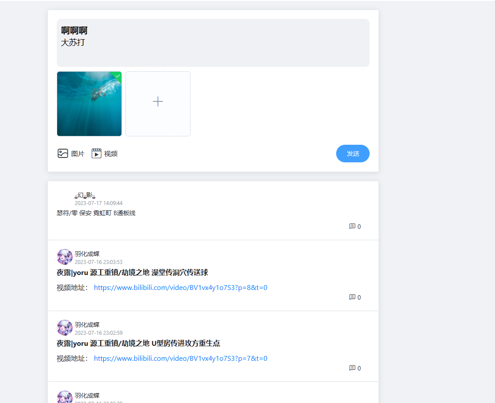
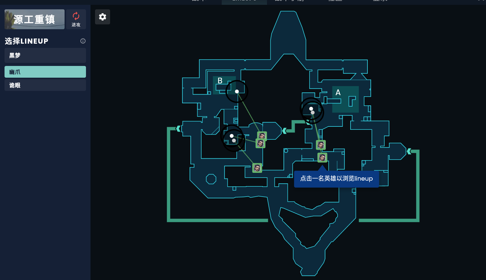

我们目前要做的是围绕无畏契约的点位教学图。

## 参考网站

这里有两个参考网站: (ctrl+鼠标左键点击标题可以跳转到该网页)

### [LKVAL](https://lkval.com/)


左上可以选择地图,角色,技能,鼠标点击到地图上的点位时,会弹出新界面,里面是点位的简单图文介绍以及视频链接。


此外,还有一个通过QQ登录功能,登录上去后可以分享点位:



### [ValoPlant - 无畏契约战术和lineup](https://valoplant.gg/zh)



进入页面后可以更换地图,进攻方/防守方,英雄

鼠标点击英雄头像点位时,会弹出窗口,窗口内是介绍视频:


此外该网站还有一些战术沟通的功能,与我们的初衷有点偏差先不讨论。


# 功能描述

## 用户端

### 功能1 地图浏览

**描述**

个人认为我们的网站应该是这样的,开启网站时,映入眼帘的就是与`lkval`相似的界面,并且可以随着鼠标滚轮放大缩小。


**目前状态**

开发中


### 功能2 点位

**描述**

用户在网页左侧选择地图,英雄,技能,随后地图展示出点位,当用户点击某个点位时,应该弹出窗口(而不是弹出新页面)来展示点位的用法,弹出的窗口中不应该包含视频(可能会有侵权等一系列问题很麻烦,而且我认为图文形式就足够反应信息了。),只包含图文来解释点位。图文中应该包含:

1.   释放技能时的站位文字描述,以及图片描述。
2.   技能释放时鼠标瞄准方向的文字描述,以及图片描述。
3.   (可选)技能释放时机以及释放效果。

**目前状态**

开发中


### 功能3 点位筛选

**描述**

随着点位增多地图上点位的展示可能过于繁杂,在地图的左侧或者上方应该有一个可以拖动的条(或者输入框),用来选择当前展示点位的数量,点位根据好评程度从高往低依次展示。

好评程度= 点赞数 / (点赞数 + 踩数)

**目前状态**

未开始


### 功能4 登录

**描述**

简单的登录功能

**状态**

已完成

**后续完善**

| 功能名称                             | 状态   |
| ------------------------------------ | ------ |
| 根据tokenid将非法访问某url的用户过滤 | 未开发 |
|                                      |        |
|                                      |        |

### 功能5 点位评价

**描述**

对于每个点位,有👍,👎两种评价方式,每个用户对于每个点位仅能评价👍或者👎仅一次。

**状态**

未开始

### 功能6 反馈

**描述**

用户可以直接上传word到服务器来进行反馈,不仅仅可以反馈点位也可以对网站建设提出见解。

反馈功能我建议我们先考虑上传word,等网站进一步发展后再考虑嵌入一个复杂的在线word编辑器,类似`lkval`的`上传点位功能`。同时限制上传的单个文件大小,用户每日上传word数量。

**状态**

开发中

## 后台管理

### 功能1 点位管理

**描述**

对于点位应该有增加/删除/修改三种功能,对于点位的增加修改,应该有管理员先选择地图,英雄,技能,随后通过放大地图,精确选择点位,然后管理员上传描述点位的文档。

**状态**

开发中

### 功能2 反馈管理

**描述**

用户将word上传到服务器内,管理员直接查看word即可得到反馈。

**状态**

开发中

### 功能3 地图管理

**描述**

管理员可以上传地图图片,删除地图,编辑地图名称等。

**状态**

前端开发中

### 功能4 角色管理

**描述**

管理员可以上传英雄图片等。

**状态**

前端开发中

### 功能5 注册/登录/权限验证

**状态**

开发中


# 细节补充

### 登录/注册

用户登录时,应该指定账号和密码,密码的规则有很多规范,不必多说。

账号必须是唯一的,有以下几种方式:

1.   邮箱登录

2.   手机号码验证消息登录

3.   第三方(qq,微信)登录

     

#### 邮箱登录/注册

注册: 注册时需要验证码,通过邮箱发送验证码。

登录: 邮箱+密码即可。

优点: 从开发角度讲最方便

缺点: 从用户角度讲比较麻烦

#### 手机号登录/注册

注册: 注册时需要验证码,通过手机发送验证码。

登录: 手机号+密码即可。

优点: 从用户角度讲比较方便。

缺点: 但是要收费。 阿里云3分钱一条;腾讯云3-5分钱一条(取决于套餐);

#### 第三方登录/注册

注册: 直接扫码一键注册与登录。

优点: 用户角度讲最方便,也很安全(不用输入账号密码)

缺点: 代码不好写..

[如何实现QQ第三方登录 - 知乎 (zhihu.com)](https://zhuanlan.zhihu.com/p/35651406#:~:text=如何实现QQ第三方登录 1 登录 connect.qq.com%2F ，注册成为QQ互联平台开发者，注册一个网站应用,2 准备一个可访问的域名 3 一个服务器来承载我们的网站应用。 阿里云，腾讯云，或者是自己搭建的都可以)

### 查询点位

用户查询点位有两个步骤:

1.   用户选择英雄,地图,技能,选好后,屏幕上会出现符合要求的所有点位的`位置信息`(没有展示具体的图文信息)。
2.   用户点击某个点位,屏幕上展示图文信息,以及这个点位的点赞数,点踩数。

因此我们做点位查询也有两步:

1.   根据 英雄,地图,技能查询所有点位的位置信息,即StandX,StandY,PutX,PutY这几个

     ```go
     
     type Position struct {
     	ID        uint           `gorm:"primarykey" json:"id,omitempty"`
     	DeletedAt gorm.DeletedAt `gorm:"index" json:"omitempty"`
     	HeroID    byte           `json:"hero_id,omitempty"` //所属英雄
     	Skill     byte           `json:"skill,omitempty"`   //所属技能
     	MapID     uint           `json:"map_id,omitempty"`  //所属地图
     	StandX    float32        `json:"sx,omitempty"`
     	StadnY    float32        `json:"sy,omitempty"`
     	PutX      float32        `json:"px,omitempty"`
     	PutY      float32        `json:"py,omitempty"`
     	Like      int            `json:"like,omitempty"`    //点赞数
     	Dislike   int            `json:"dislike,omitempty"` //点踩数
        Description string         `json:"description,omitempty"`
     }
     ```

2.   用户点开某个点位时,展示点位的`Description,Like,Dislike`

因此设计了两个接口:

```
GET: /positions		传入hid,mid,skill 	 返回position列表
GET: /position   		传入id					返回单个position
```


