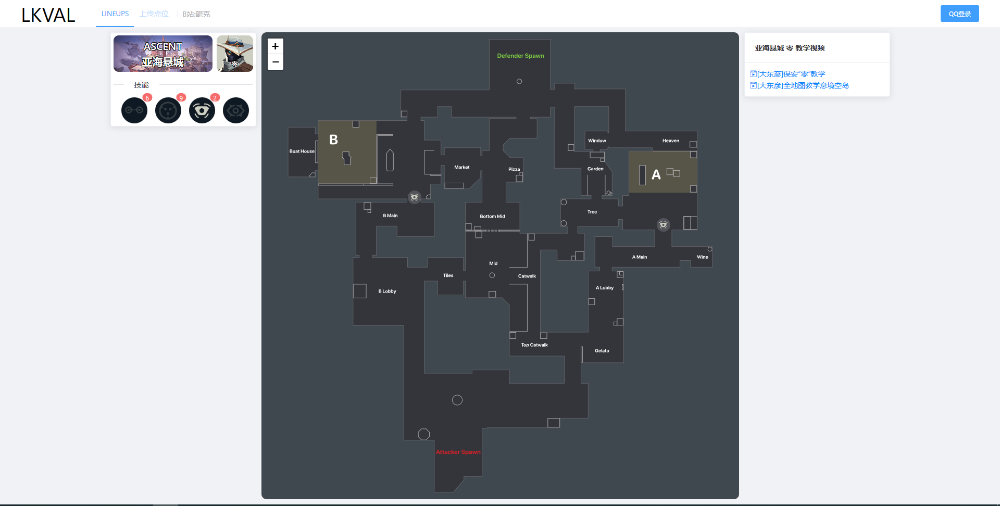
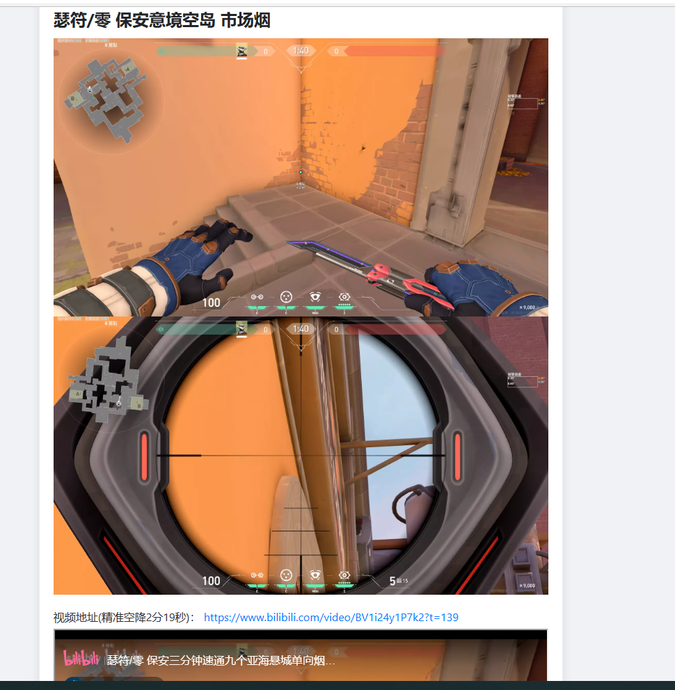
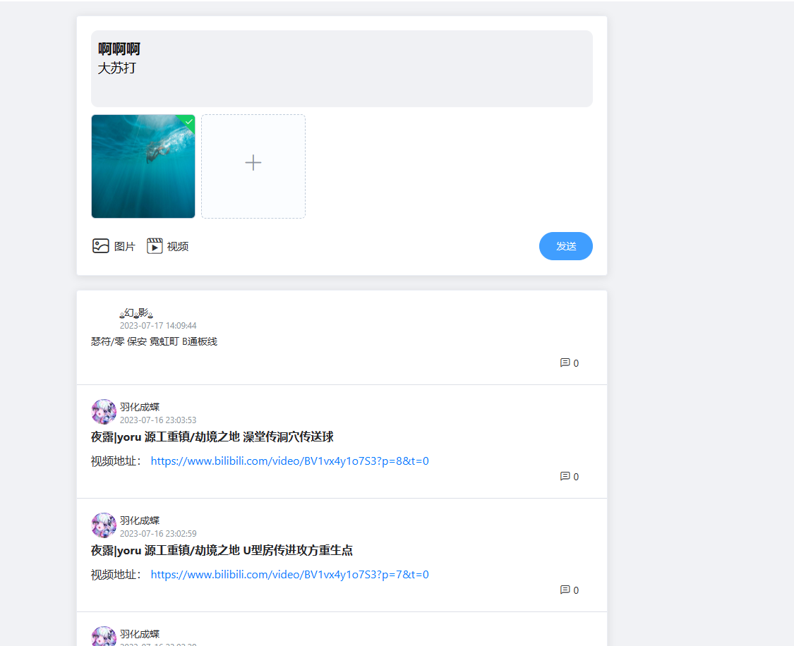
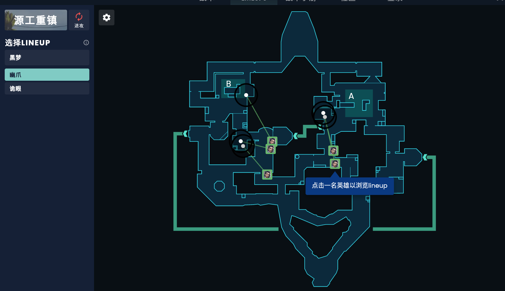
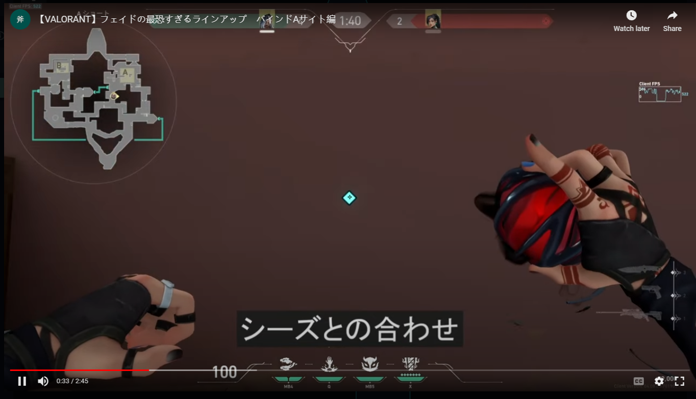
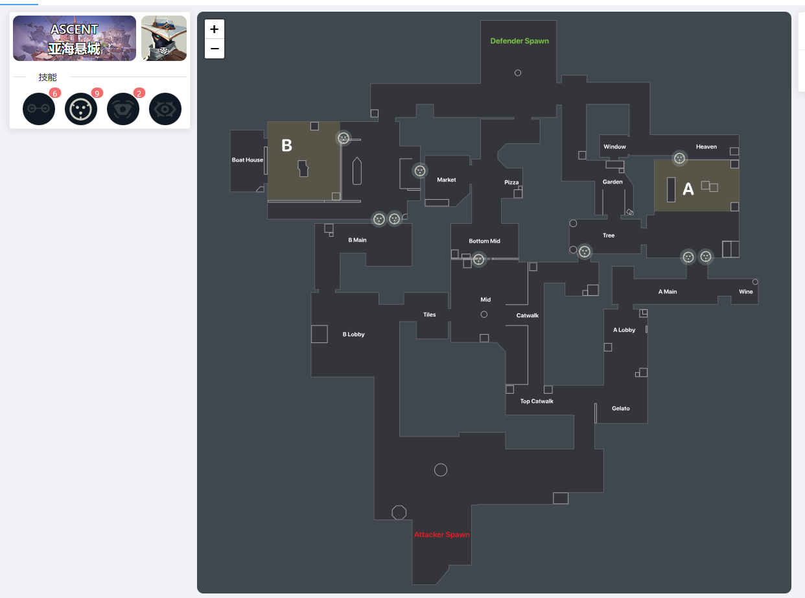

我们目前要做的是围绕无畏契约的点位教学图。

## 参考网站

这里有两个参考网站: (ctrl+鼠标左键点击标题可以跳转到该网页)

### [LKVAL](https://lkval.com/)

左上可以选择地图,角色,技能,鼠标点击到地图上的点位时,会弹出新界面,里面是点位的简单图文介绍以及视频链接。

此外,还有一个通过QQ登录功能,登录上去后可以分享点位:

### [ValoPlant - 无畏契约战术和lineup](https://valoplant.gg/zh)

进入页面后可以更换地图,进攻方/防守方,英雄

鼠标点击英雄头像点位时,会弹出窗口,窗口内是介绍视频:

此外该网站还有一些战术沟通的功能,与我们的初衷有点偏差先不讨论。

## 用户端

### 功能1 地图

个人认为我们的网站应该是这样的,开启网站时,映入眼帘的就是与`lkval`相似的界面,并且可以随着鼠标滚轮放大缩小。

### 功能2 点位

用户在网页左侧选择地图,英雄,技能,随后地图展示出点位,当用户点击某个点位时,应该弹出窗口(而不是弹出新页面)来展示点位的用法,弹出的窗口中不应该包含视频(可能会有侵权等一系列问题很麻烦,而且我认为图文形式就足够反应信息了。),只包含图文来解释点位。图文中应该包含:

1.   释放技能时的站位文字描述,以及图片描述。
2.   技能释放时鼠标瞄准方向的文字描述,以及图片描述。
3.   (可选)技能释放时机以及释放效果。

### 功能3 点位筛选

随着点位增多地图上点位的展示可能过于繁杂,在地图的左侧或者上方应该有一个可以拖动的条(或者输入框),用来选择当前展示点位的数量,点位根据好评程度从高往低依次展示。

好评程度= 点赞数 / (点赞数 + 踩数)

### 功能4 登录

简单的登录功能

### 功能5 点位评价

对于每个点位,有👍,👎两种评价方式,每个用户对于每个点位仅能评价👍或者👎仅一次。

### 功能6 反馈

用户可以直接上传word到服务器来进行反馈,不仅仅可以反馈点位也可以对网站建设提出见解。

反馈功能我建议我们先考虑上传word,等网站进一步发展后再考虑嵌入一个复杂的在线word编辑器,类似`lkval`的`上传点位功能`。同时限制上传的单个文件大小,用户每日上传word数量。

## 后台管理

### 功能1 点位管理

对于点位应该有增加/删除/修改三种功能,对于点位的增加修改,应该有管理员先选择地图,英雄,技能,随后通过放大地图,精确选择点位,然后管理员上传描述点位的文档。

### 功能2 反馈管理

用户将word上传到服务器内,直接查看word即可。

